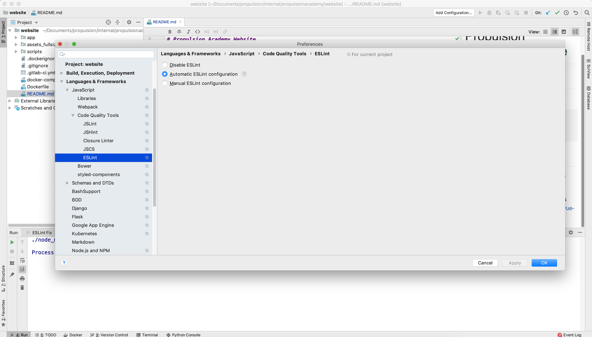
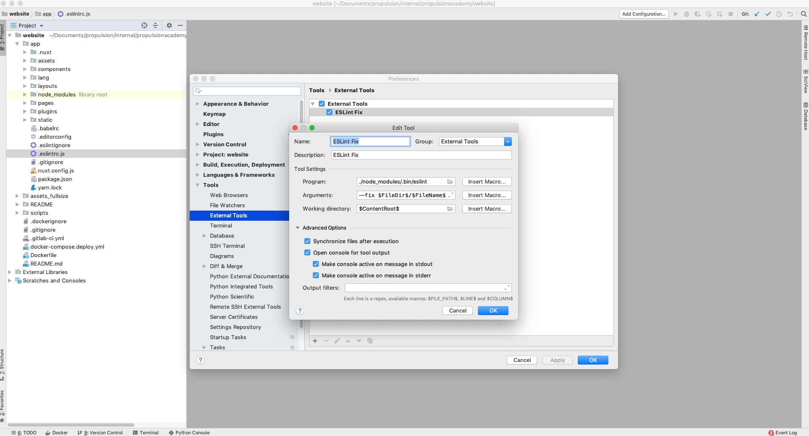
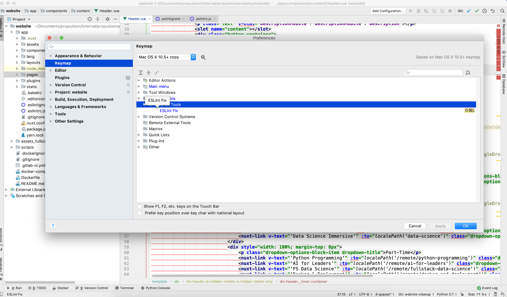

# React-Redux Template
This module comes with out of the box user login, registration, registration validation is designed to be used in concert with
the django backend template. https://gitlab.propulsion-home.ch/propulsion/projects/templates/django-social-media

If you want to use it with another backend change the dispatched actions accordingly.

## Dev mode
Run it without docker and with yarn:

```
yarn

yarn run dev
```

## ESLint
1. You need to set up PyCharm to use ESLint:

With this setting Pycharm should autodetect the ``.eslintrc.js`` which eslint uses as config file.
This should be enough for Pycharm to show you ESLint suggestions in the code.

To set up things for ESLint to automatically fix the problems it can fix make these two configurations:

Define an external command:


Bind the external command to a custom key combo:


Now hitting the key combo while in a file should ``eslint --fix`` that file and that file only.


